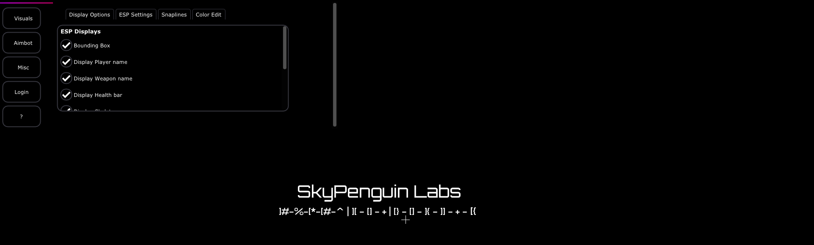

# Intro To REplay
REplay is a high-end and low-profile gutted game cheat written in C++20 that was designed to toss people into real-life environments to practice software cracking. This project was designed and developed due to the lack of playgrounds and projects to practice reverse engineering outside of smaller command line based environments. For example- small crackmes are amazing for beginners, but when you transition into the real world, often times, you sit through thousands of symbols, functions, and more. So we thought, why not develop something semi-real world. 

This is a game cheat, but after development, a copy of the source was made, driver code & exploit code was **mostly** removed and the mass amount of security systems were removed and replaced with basic checks. We then inserted the code with sets of sensitive information, hardcoded passkeys, algorithms, and more that can be used to practice reverse engineering. 

# Playing the CTF
The CTF is simple to play. Simply load the EXE up and toss it into IDA or Ghidra for static analysis and a tool of your choice for dynamic analysis. Of course, we could not leave you without information. So here are some things you should know.

## Scenario 
In this scenario, you are a reverse engineer who cracks black-hat frameworks (unethical frameworks such as DDoS panels) for a living and re sells them. You come across a game cheat that you want to crack, crack it and also document specific information about the program including an undocumented button that shuts down the menu. Many users as we have also seen, complained that when pressing tab exits the menu conflicting with other options- find this virtual key and modify it to become another key. When you are done with both main tasks, go on a hunt to see what else you can find about this cheat.

## Technical Information
This CTF is GUI based, written in C++20, and was built using Microsoft Visual Studio with ImGui and D3DX11 implementations.

## Level Information
Currently, we only have one level finished and done, so this is a 'beta-test' you can call it for the entire idea. This level has basic encryption techniques, basic anti-debug techniques, and a plethora of information to gather. This level was designed for beginners. However, in the future there will be other levels which are intermediate and expert levels.

> Intermediate
This level will be for people who know reverse engineering well. It will include many strong anti-analysis techniques, will include many anti-sandboxing techniques and will include stronger encryption and larger logic + more advanced system breaking. We will also require you to know a tad bit of binary auditing to spot flaws in the binaries code.

> Expert/Practitioner 
This will be the hardest level yet. It will compress every level together, lock the programs process down, heavily secure and mask information and data, prevent basic to advanced analyzers, and will require skillsets in binary analysis, binary auditing, exploit development, Windows internals, key generation & algorithm reverse engineering, standard software cracking, logic manipulation, and more. This will be a full fledged highly advanced version of the playground that was designed to be mostly real world.

## What to solve for?
This CTF is an entire playground and there is more to reverse engineer than the defaults we provide. But we did decide that in order to make it fun, there should be some things that you need to do as `goals` for completing each new level. In this case, we decided to create a simple list.

> Here are your goals for Level 1

* 1: Find the unencrypted API key 
* 2: Find the HTTP-BasicAuth formatted username and password
* 3: Find the CTF information block
* 4: Find the encrypted API key
* 5: Crack the first login system
* 6: Modify the variable of the hide menu functionality
* 7: Find out what was the authentication server where the HTTP auth was used?
* 8: Find out what protocol was the authentication server in
* 9: Find out what security systems were used in this CTF
* 10: Figure out a base map of the control flow in the programs first login system. Draw out a pseudo code example of how this works.
* 11: Find the integer based key used to compare the input license in the GUI. 
* 12: Figure out where the pre-determined login statement is being made. This is the statement in which is outputted or drawn onto the GUI before the login button and the input box are rendered. 
* 13: Find the hotkey that is used to exit the menu and kill the current process

### Quiz / Questions To Answer For Level 1
If you want to answer some questions, then here is a good map to do that with.

> **Question 1**: What was the unencrypted & plaintext CTF key?

> **Question 2**: What was the basic authentication username and password?

> **Question 3**: What was the primary API key found dynamically?

> **Question 4**: What was the information block of the CTF?

> **Question 5**: The first log in was crackable in two ways. One of those ways was to switch the logic of the program around. What did you need to do in order to switch it? Answer format - `I changed x to x at` where x is the instructions.

> **Question 6**: What security systems were used in this CTF?

> **Question 7**: What was the authentication server where the HTTP auth was used?

> **Question 8**: What protocol was the authentication server in?

> **Question 9**: On the first login attempt, you may have noticed that the application already outputted that the login failed without you doing anything. What does this mean?

> **Question 10**: In the login system, there is no plaintext key that you can see. Instead, the key was integer-based. How did this key system work, what did it do, what was the value(s) of the key, and what was the final string key?

> **Question 12**: What `.text` address held the location of the comparison for the logged-in variable? Remember that this was the pre-set variable that was checked before the initial state of both the input and the button are rendered on the GUI. Tell me how you know this :D

> **Question 13**:  What key was needed to exit and close the game cheat?

